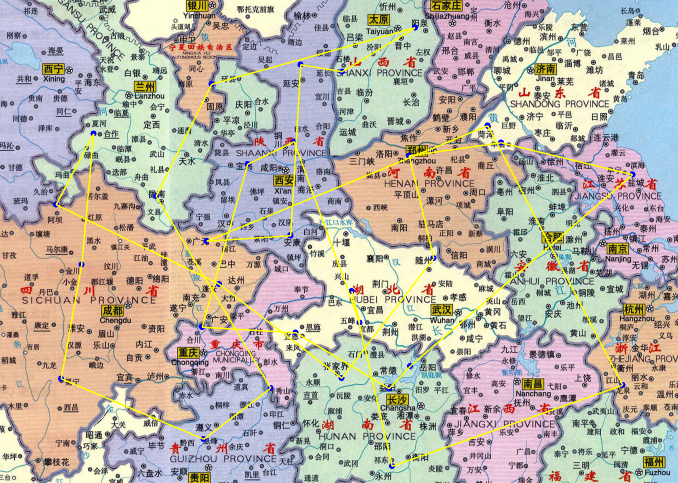

# project问题陈述
请同学们自行提出一个可以通过编程解决的问题，并拟定潜在的解决方案，并在12周前与助教确定该问题和可能的解决方案。

当得到助教支持后可进行相应的问题解决。（注意：若无自选问题，课程组会在第10周提供一个备选题目。）

要求：

代码在500~1500行左右，请对问题求解的相关代码做一个合理的估算。

需要涉及的技术包括（但不仅限于）各类启发式算法、数值计算、计算几何、利用FLTK进行图形界面编程、库的使用等。

遵循课程中提到的问题求解过程，并且得到助教的支持。


我们鼓励同学们结合现实问题，进行更多的问题拓展与思考。
如果选择该备选题目，也需要与助教确认问题描述。

---

## 粗略的想法如下

结合要求的话，我打算写一个利用遗传算法求解旅行商问题，并且利用fltk进行可视化的C++程序。

结合海贼王，经典台词，“如果要旅行的话，你想到哪儿？”

## 问题描述

先描述用户使用的场景。打开程序，运行后出现地图，终端交互，让用户点击地图上的点来表示，然后程序使用GA算法给出最短路径，计算的过程步数在终端输出。然后在地图上画出最短路径。

---

- 初步目标
    - 用遗传算法求解旅行商问题（给定矩阵坐标）
    - 用fltk进行可视化
    - 用C++编程
    - 直接画出最短路径
- 进阶目标
    - 点击选点
    - 如果用户选的点数错误，不能直接退出，而是可以撤销或者继续点


---
# 问题描述和数学建模
## 自然语言描述
给定一系列城市和每对城市之间的距离，求解访问每座城市一次并回到起始城市的最短回路。

## 数学建模
### 已知条件

给城市编号，那么所有解构成的集合就是$\{x_1,x_2,x_3,...,x_i,...x_j,...,x_{n},x_{n+1} \}$，其中$x_1$和$x_{n+1}$相等这样一个的排列。所有城市的坐标已知，为了计算方便，可以构建两两城市之间的距离矩阵$d$，其中$d_{ij}$表示从城市$i$到城市$j$的距离。

一个简单而重要的假设是，我们认为来回的距离是相同的。

---
### 目标函数
$d = f(x_1,x_2,x_3,...,x_i,...x_j,...,x_{n+1})=\sum_{i=1}^{n} d_{x_i,x_{i+1}}$
### 新解的产生

某个个体是$<x_1,x_2,x_3,...,x_i,...x_j,...,x_{n},x_{n+1}>$


通过变异产生的新个体
-    $<x_1,x_2,x_3,...,x_i,...x_j,...,x_{n+1}>$，其中$i,j$是随机生成的，$i<j$，然后将$x_i$和$x_j$交换位置。

--- 

通过交叉产生的新个体
1. 选择两个父代个体，$<x_1,x_2,x_3,...,x_i,...x_j,...,x_{n},x_{n+1}>$和$<y_1,y_2,y_3,...,y_i,...y_j,...,y_{n},y_{n+1}>$
2. 选择一个随机的$i$和$j$，$i<j$
 3. 从$x_i$到$x_j$的城市编号，然后将$y$中的除了$x_i$到$x_j$的城市的编号依次填入$z$的其它位置，得到新的个体$<z_1,z_2,z_3,...,z_i,...z_j,...,z_{n},z_{n+1}>$，其中$z_i$到$z_j$的城市编号是从$x_i$到$x_j$的城市编号。


---
谈到输入输出（在fltk中用handle函数实现）

- 点击选点，将坐标压入city数组，并且在地图上画出来

- enter表示确认。开始计算并
    - 输出到终端
    - 开始画图（依次画出路径）


---

## 针对问题的讨论
稍加修改和限制，我们还可以得到更多有实际意义也更困难的问题。
- 可以实际化这个问题，比如我从上海想要经过江苏的十三个省再回上海，怎么最省时间。
- 利用实际数据并且利用python处理得到距离矩阵，传入SA_TSP.f90里面
- 对cost的定义不单单的时间层次的，而是路途时间、票价的二元函数，这要求对目标函数进行修改。
- 来回的cost并不同，原来的无向图变成有向图。
- 在路径当中加入某些硬性要求，比如在去B城市之前一定要历经A城市，去了B城市后在一定时间内必须到达C城市，这或许要在代入解计算目标函数之前进行一定的条件判断。


---

## 参考

https://zhuanlan.zhihu.com/p/277404168


## 编译和使用
```bash
make
./main
```

- 在途中鼠标左键点击表示选中该点
- Enter表示结束（如果城市的个数和宏定义的N不同，则会返回提醒。
- 按Backspace键来删除上一个点。
## 自测运行

## demo1 中国地图  30个点
<!-- 图片指定宽度，然后保持长宽比不变 -->


如果点击的点少于30个，如图所示 


则会如下提示


选定30个点后，按下enter键，会在终端输出最短路径的长度，以及路径的顺序，如图所示




## demo2 海贼王地图 10个点

其它使用方法和demo1相同，如图所示,此处仅贴出最终结果


